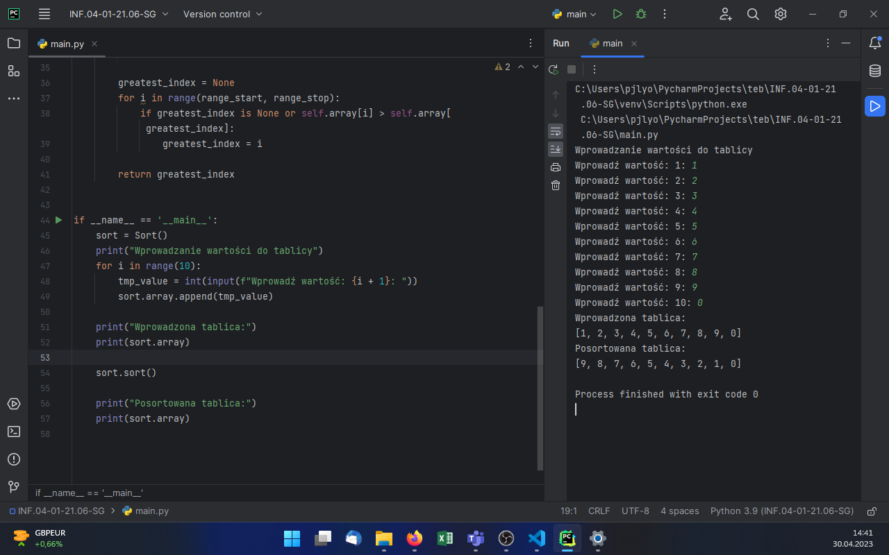
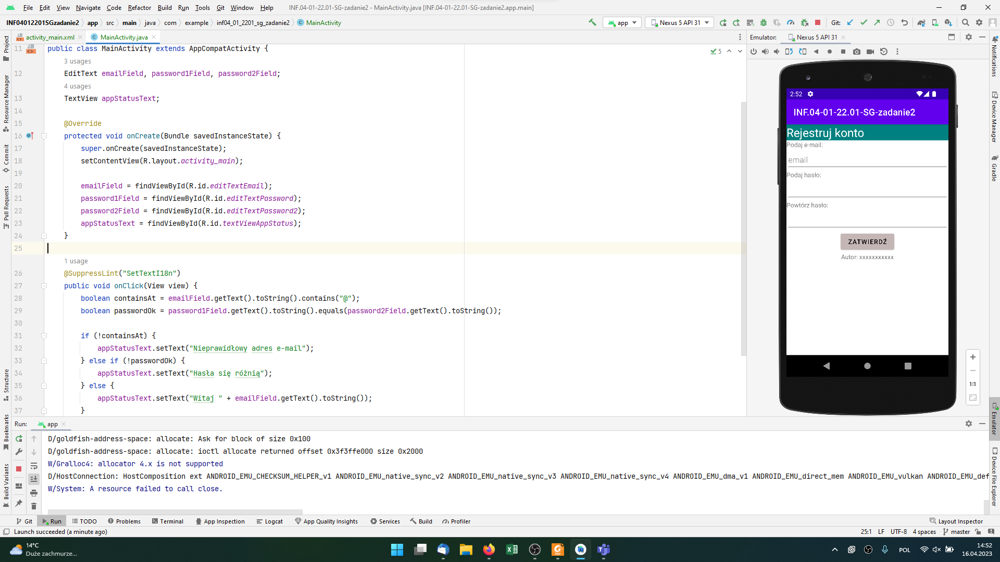
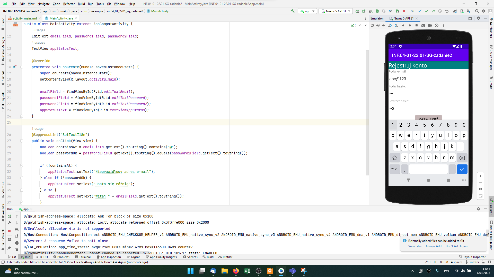
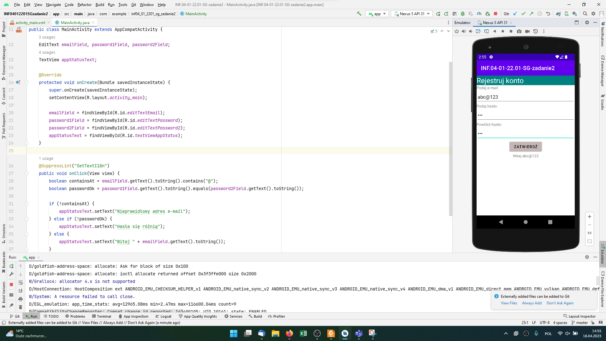
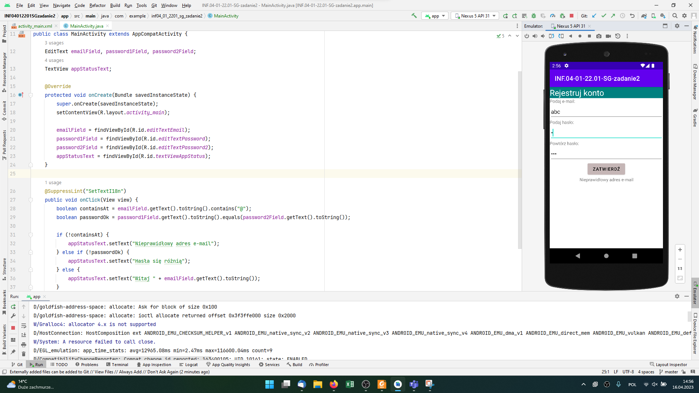
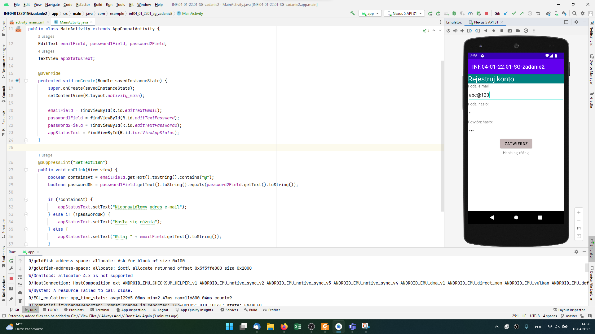

# INF.04-01-21.06-SG

## Informacje o rozwiązaniu

System operacyjny: Windows 11 Pro wersja 22H2

Nazwy środowisk programistycznych: PyCharm 2023.1 (Professional Edition); Android Studio Electric Eel | 2022.1.1 Patch 2

Nazwy języków programowania: Python; Java

Emulowane urządzenie / system: Nexus 5 (API 31), Android 12 (Oreo)

Komentarz do wykonanej pracy: brak

## Aplikacja konsolowa

Rysunek 1. Przedstawiony wynik działania aplikacji - wprowadzono kolejne dziesięć elementów tablicy, wyświetlono tablicę po wprowadzeniu oraz po posortowaniu.

## Aplikacja mobilna

**Uwaga.** Zrzuty są z zadania [INF.04-01-22.01-SG](/INF.04-22.01/INF.04-01-22.01-SG/), ponieważ aplikacja mobilna w tych zadaniach była identyczna. Na zajęciach kursu realizowaliśmy jednak to zadanie przed poprzednim, stąd najpierw to.

Rysunek 2. Stan po uruchomieniu aplikacji.

Rysunek 3. Wprowadzono poprawne dane, nie wciśnięto jeszcze przycisku Zatwierdź.

Rysunek 4. Ukryto klawiaturę i wciśnięto przycisk Zatwierdź.

Rysunek 5. Wprowadzono niepoprawny adres email i wciśnięto przycisk Zatwierdź.

Rysunek 6. Wprowadzono niepoprawny adres email oraz niepoprawne pierwsze hasło (względem drugiego) i wciśnięto przycisk Zatwierdź.

Rysunek 7. Wprowadzono poprawny adres email i niezgodne hasła oraz wciśnięto przycisk Zatwierdź.
