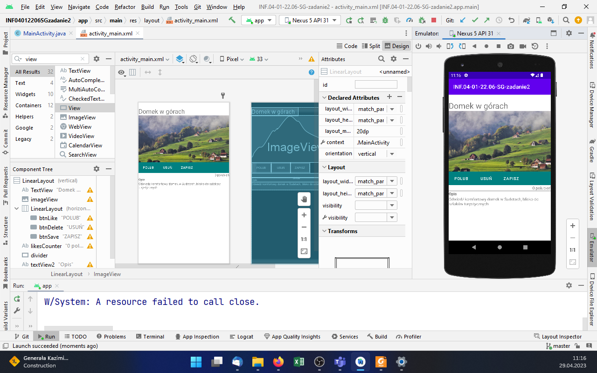
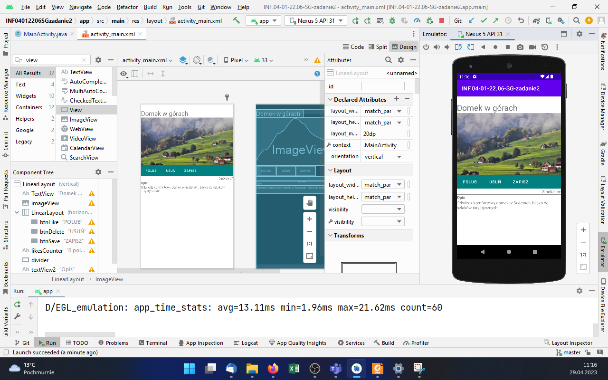
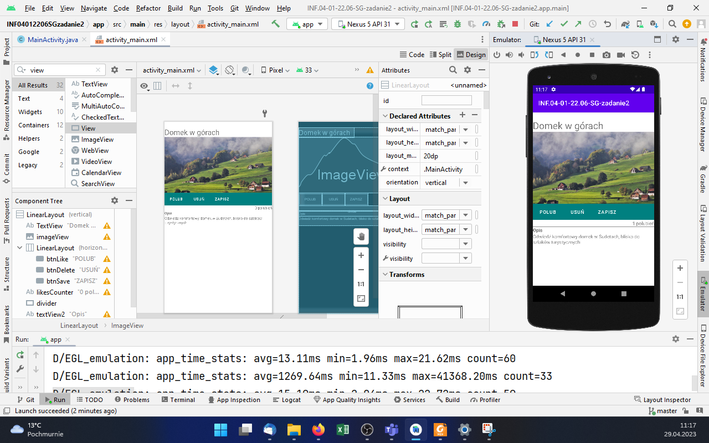
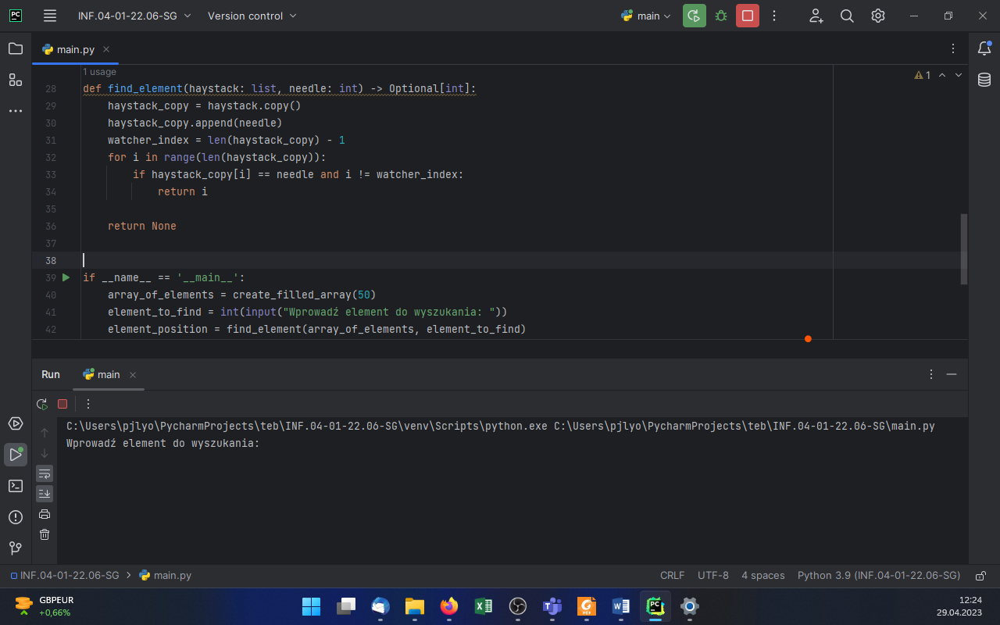
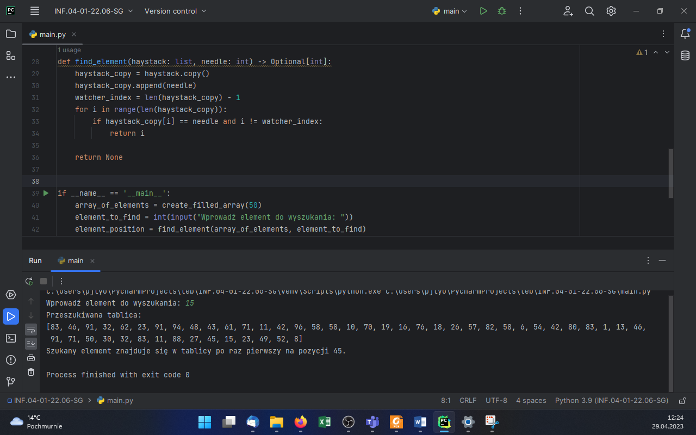
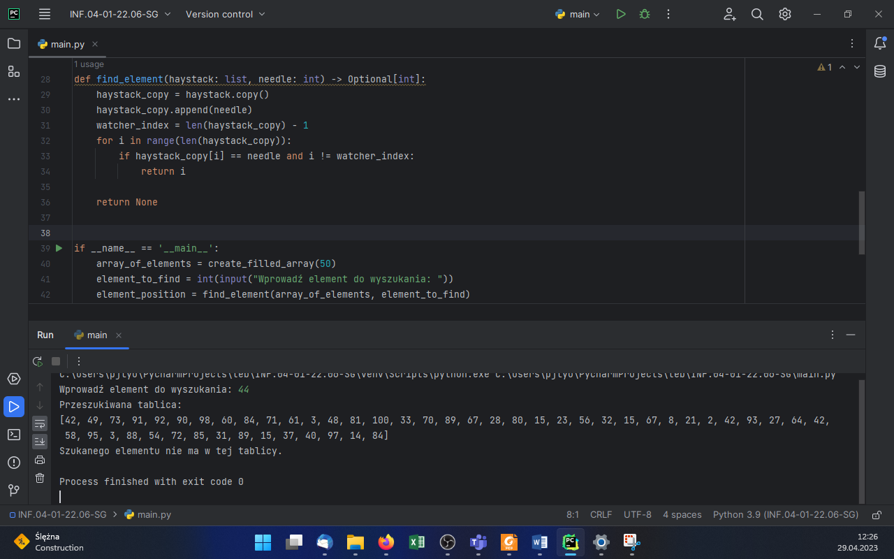

# INF.04-01-22.06-SG

## Informacje o rozwiązaniu

System operacyjny: Windows 11 Pro wersja 22H2

Środowiska programistyczne: Android Studio Electric Eel | 2022.1.1 Patch 2; PyCharm 2023.1 Professional Edition

Języki programowania: Java; Python

Emulator systemu mobilnego: Nexus 5 API 31

## Aplikacja mobilna

Rysunek 1. Stan początkowy aplikacji.

Rysunek 2. Kliknięto przycisk "POLUB" 3 razy.

Rysunek 3. Następnie kliknięto przycisk "USUŃ" 2 razy.

## Aplikacja konsolowa

Rysunek 4. Aplikacja po uruchomieniu.

Rysunek 5. Wprowadzono wartość 15 i wciśnięto klawisz Enter. Wartość ta znajduje się na wygenerowanej liście.

Rysunek 6. Inne uruchomienie programu, wprowadzono wartość 44, której nie ma na wygenerowanej liście.
