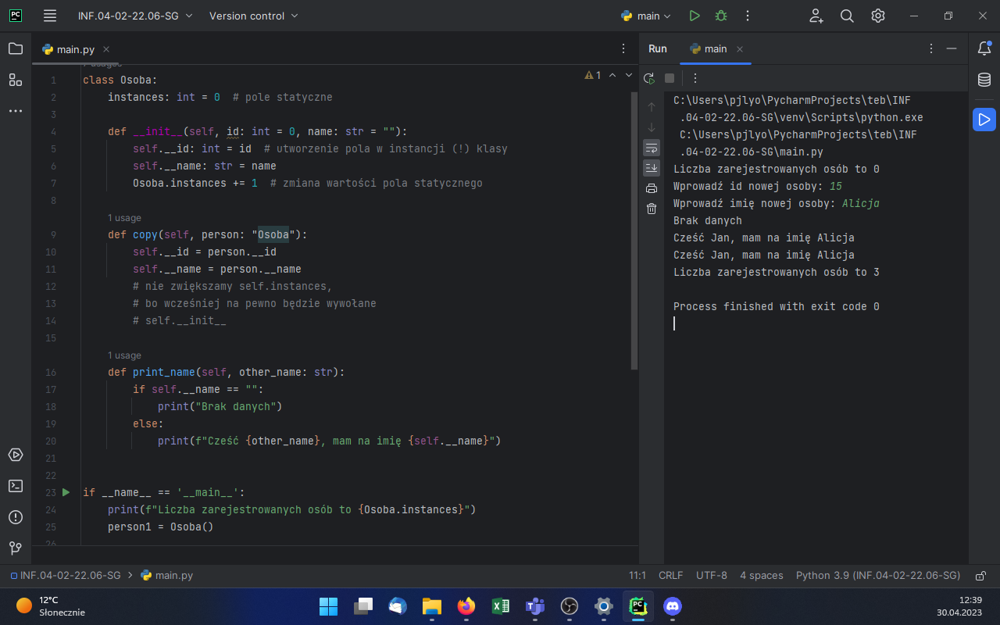
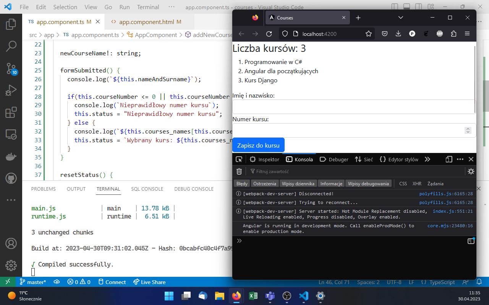
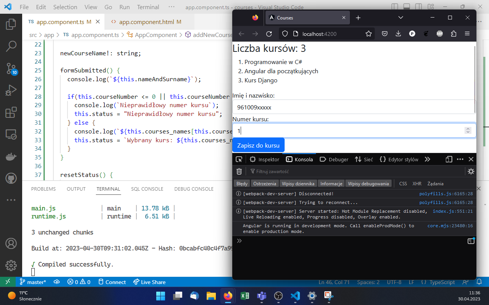
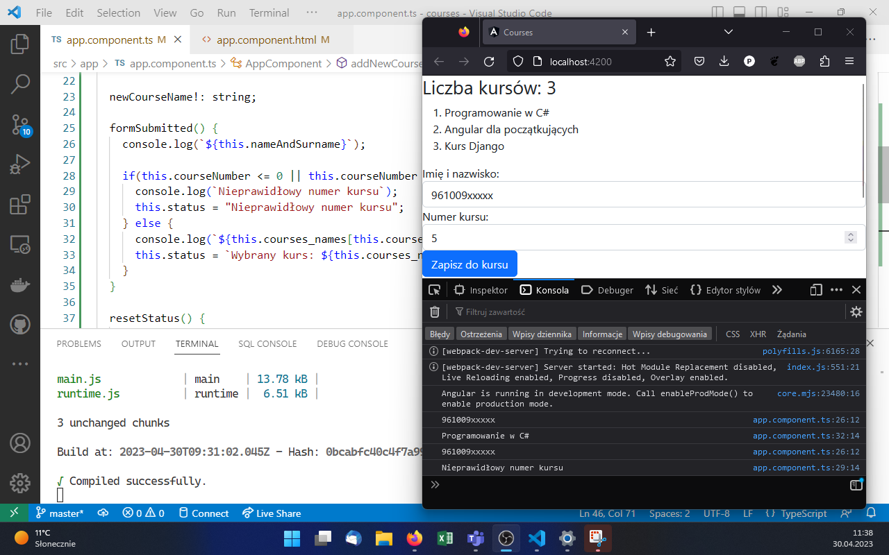

# INF.04-02-22.06-SG

## Ważne

To rozwiązanie powstawało na zajęciach [kwalifikacyjnego kursu zawodowego INF.04](https://teb.pl/kierunki/d/projektowanie-i-testowanie-aplikacji/). Zostało **rozbudowane** o następujące elementy:

- dodawanie kursu do listy (zgodnie z treścią zadania program ma działać dla każdej listy, nie tylko tej 3-elementowej),
- wyświetlanie komunikatów o stanie na stronie, nie tylko w konsoli (tam też).

## Informacje o rozwiązaniu

System operacyjny: Windows 11 Pro wersja 22H2

Nazwy środowisk programistycznych: Visual Studio Code, PyCharm 2023.1 (Professional Edition)

Języki programowania / frameworki / biblioteki: TypeScript, Angular, Bootstrap; Python

## Aplikacja konsolowa

Rysunek 1. Przedstawiono działanie aplikacji konsolowej zgodnie z testem opisanym w częsci III arkusza. Wynik programu widoczny jest w prawej części okna IDE.

## Aplikacja webowa

Rysunek 2. Stan początkowy.

Rysunek 3. Wprowadzono poprawne dane do formularza, ale jeszcze go nie zatwierdzono.

Rysunek 4. Zatwierdzono formularz z poprawnymi danymi.

Rysunek 5. Zmieniono dane w formularzu na niepoprawne (nieistniejący numer kursu) i zatwierdzono.
