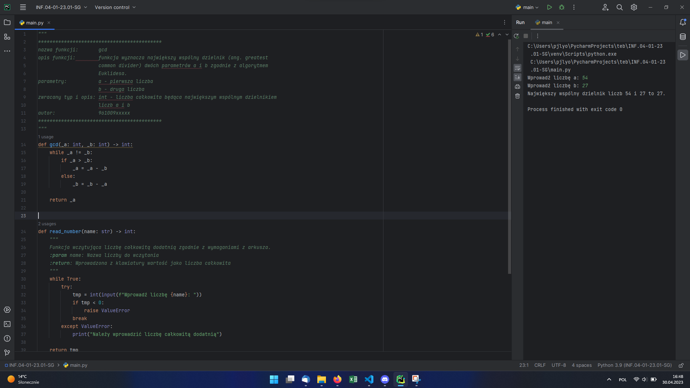
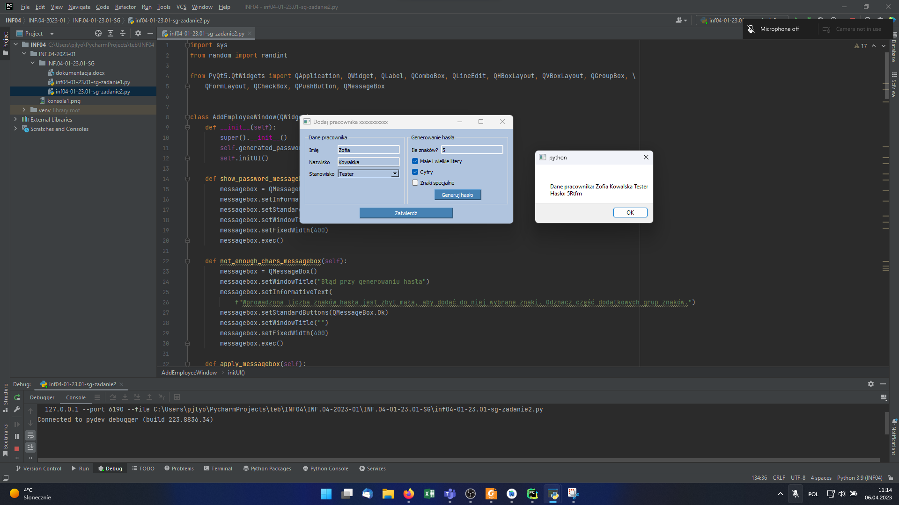
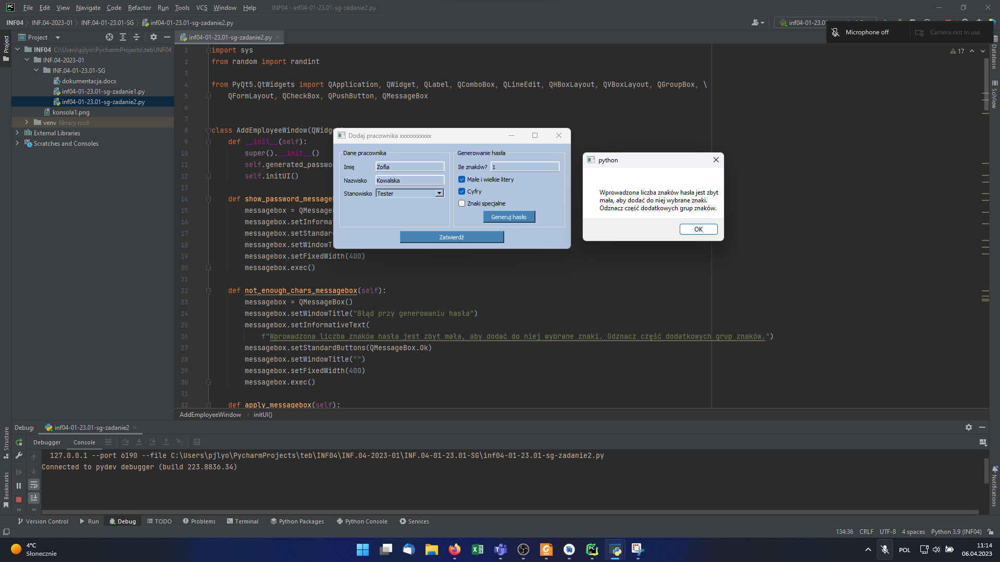
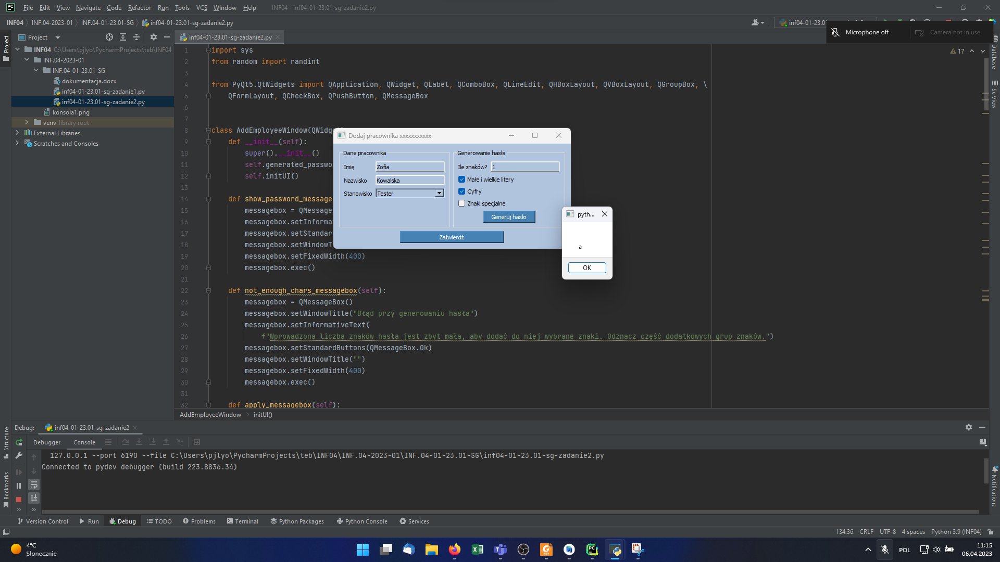

# INF.04-01-23.01-SG

## Informacje o rozwiązaniu

Nazwa systemu operacyjnego, na którym pracował zdający: Windows 11 Pro 22H2

Nazwy środowisk programistycznych, z których zdający korzystał na egzaminie: PyCharm 2022.3.3; Android Studio Electric Eel | 2023.1

Nazwy języków programowania: Python, Java

Komentarz do wykonanej pracy: W przypadku aplikacji konsolowej nie było wymagane sprawdzanie, czy ustawiono liczbę znaków tak, aby hasło mogło się wygenerować. Mój algorytm nie mógł by jednak działać bez takiego warunku, dlatego dodałem tę weryfikację. Być może niepotrzebnie wówczas pojawia się hasło niespełniające warunków – jednak wolałem to zrobić w ten sposób, aby spełnić wymagania postawione w treści zadania.

## Aplikacja konsolowa

Rysunek 1. Efekt działania aplikacji - po wprowadzeniu danych.

## Aplikacja desktopowa

Rysunek 2. Aplikacja po uruchomieniu.

Rysunek 3. Aplikacja po wprowadzeniu danych z arkusza egzaminacyjnego oraz wciśnięciu przycisku Generuj hasło.

Rysunek 4. Aplikacja po wciśnięciu przycisku Zatwierdź (wcześniej wciśnięto Generuj hasło).

Rysunek 5. Zmieniono liczbę znaków na zbyt małą, aby wygenerować hasło z wybranymi znakami - komunikat ostrzeżenia.

Rysunek 6. Po wyświetleniu poprzedniego ostrzeżenia wyświetlane jest wygenerowane hasło bez wybranych przez użytkownika znaków.
