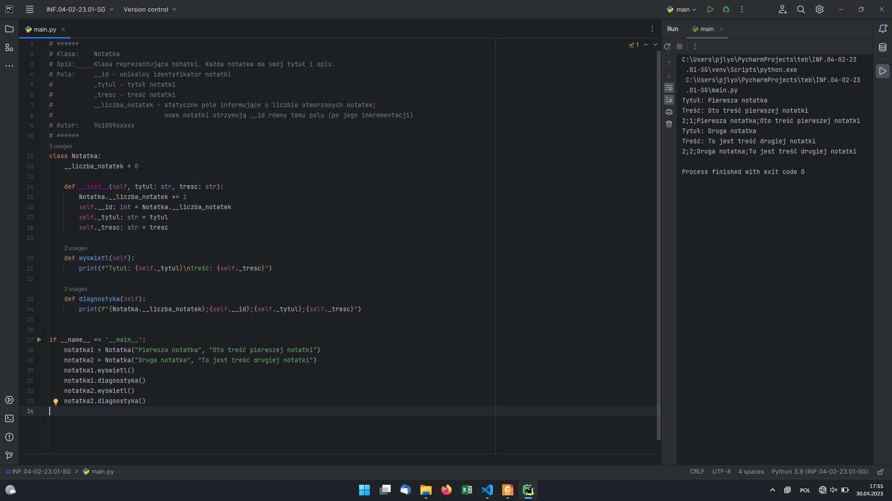
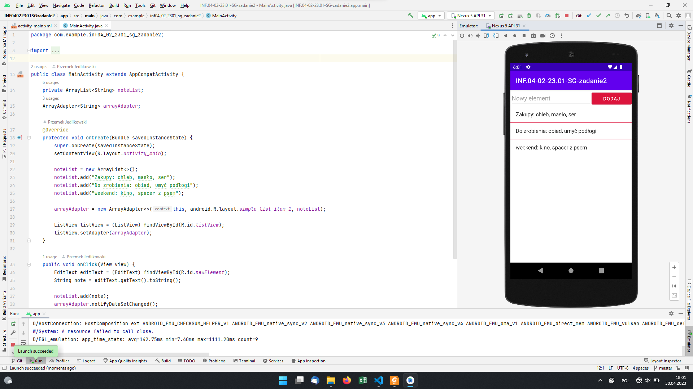
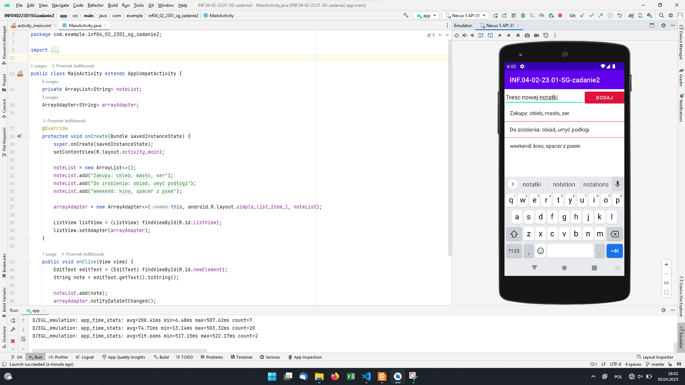

# INF.04-02-23.01-SG

## Informacje o rozwiązaniu

System operacyjny: Windows 11 Pro wersja 22H2

Środowiska programistyczne: PyCharm Professional 2023.1; Android Studio Electric Eel | 2022.1.1

Emulator aplikacji mobilnej: Nexus 5 API 33, Android 12 (Oreo)

Języki programowania: Python; Java

Komentarz: brak

## Aplikacja konsolowa

Rysunek 1. Przedstawienie pełnego działania aplikacji: wprowadzono dane i zatwierdzono je, co widać w prawej części okna IDE.

## Aplikacja mobilna

Rysunek 2. Stan początkowy - aplikacja po uruchomieniu.

Rysunek 3. Do pola tekstowego wprowadzono treść nowej notatki, ale jeszcze nie wciśnięto przycisku DODAJ.

Rysunek 4. Wciśnięto przycisk DODAJ, widok został odświeżony.
