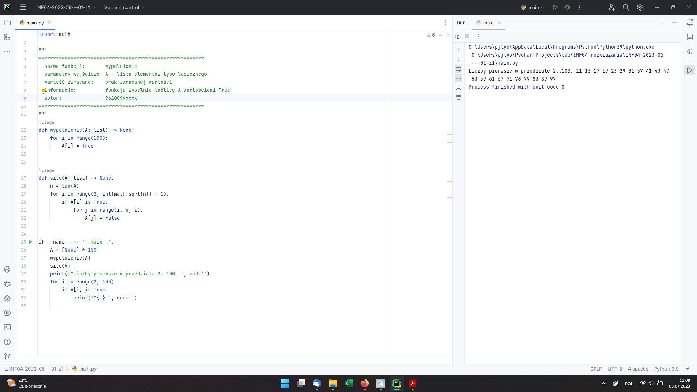
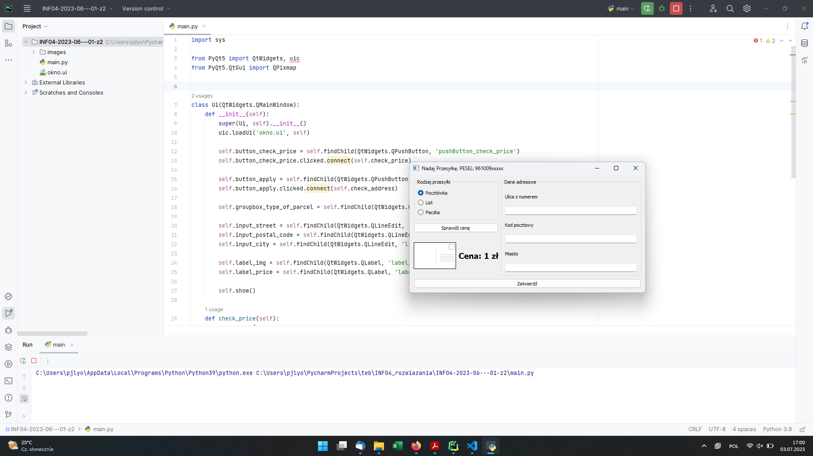
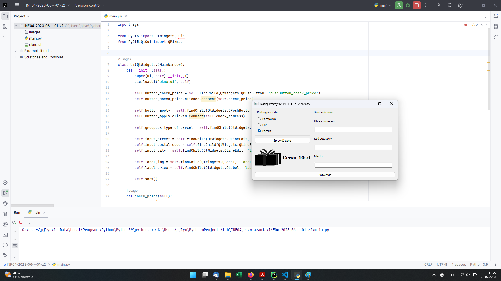
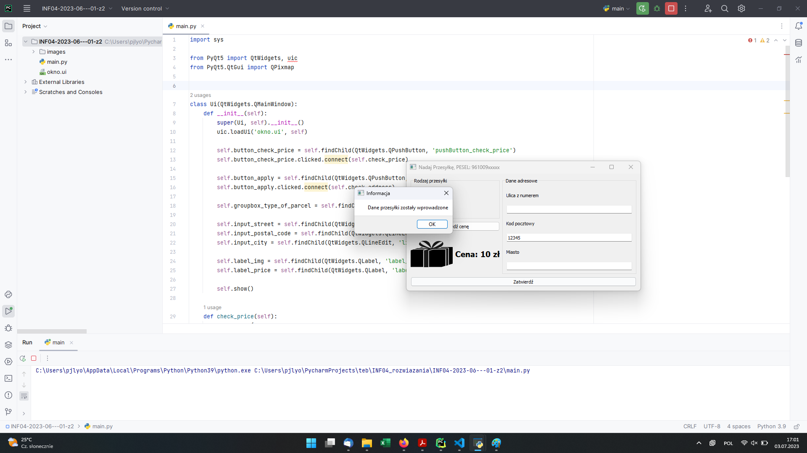

# INF.04-01-23.06-SG

## Informacje o rozwiązaniu

System operacyjny: Windows 11 Pro wersja 22H2
Nazwy środowisk programistycznych: PyCharm Professional 2023.1.1
Nazwy języków programowania: Python
Komentarz: brak

## Aplikacja konsolowa

Rysunek 1. Działająca aplikacja.

## Aplikacja desktopowa

Rysunek 2. Aplikacja w stanie początkowym.

Rysunek 3. Wybrano rodzaj przesyłki "Paczka" i kliknięto przycisk "Sprawdź cenę".

Rysunek 4. Wprowadzono poprawny kod pocztowy (zgodny z wymaganiami w arkuszu) i wciśnięto przycisk "Zatwierdź" - został wyświetlony oczekiwany komunikat.

Rysunek 5. Wprowadzono kod pocztowy zawierający znak "-", w polu wprowadzono łącznie 5 znaków - został wyświetlony oczekiwany komunikat błędu.

Rysunek 6. Wprowadzono kod pocztowy zawierający nie-pięć znaków (dokładnie - 6) - został wyświetlony oczekiwany komunikat błędu.
