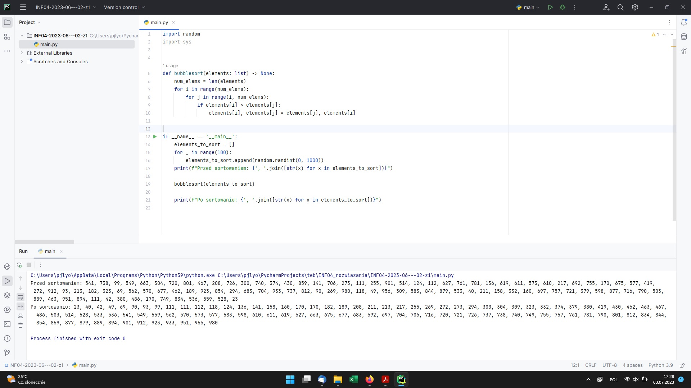
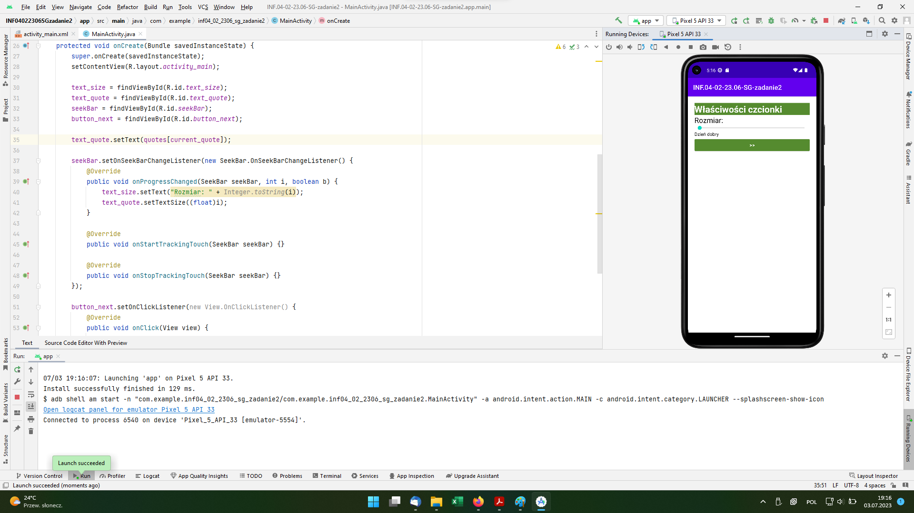
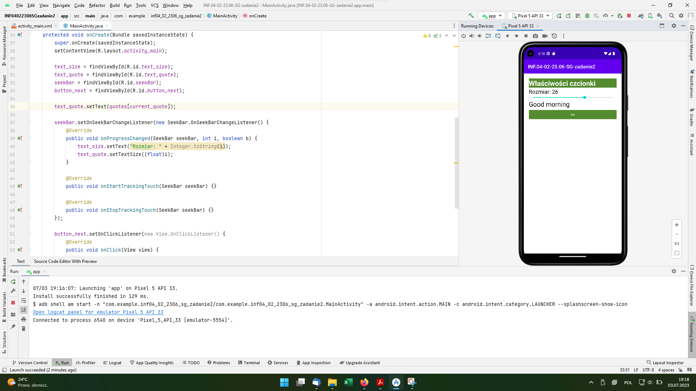

# INF.04-02-23.06-SG

**Uwaga.** To zadanie ma inny sposób dokumentowania względem wszystkich poprzednich egzaminów. Poniżej "szybka notatka" na temat zadania i dokumentowania go.

## Aplikacja konsolowa

Dokumentacja aplikacji konsolowej polegała na zrobieniu jednego zrzutu ekranu - z testu działania aplikacji.

Rysunek 1. Poprawnie działająca aplikacja konsolowa.

## Aplikacja mobilna

Dokumentacja aplikacji mobilnej polegała na zrobieniu zrzutów ekranowych z działania aplikacji mobilnej oraz stworzeniu pliku [mobilna/srodowisko.txt](mobilna/srodowisko.txt) zawierającego informacje:

> Środowisko: Android Studio Flamingo | 2022.2.1 Patch 2
>
> Urządzenie: Pixel 5 API 33 | Android 13.0 Google APIs | x86_64

Rysunek 2. Stan początkowy aplikacji.

Rysunek 3. Przesunięto pasek rozmiaru do wartości 26.

Rysunek 4. Wciśnięto jeden raz przycisk ">>".

Rysunek 5. Przesunięto pasek rozmiaru do wartości 17 oraz wciśnięto dwa razy przycisk ">>".
