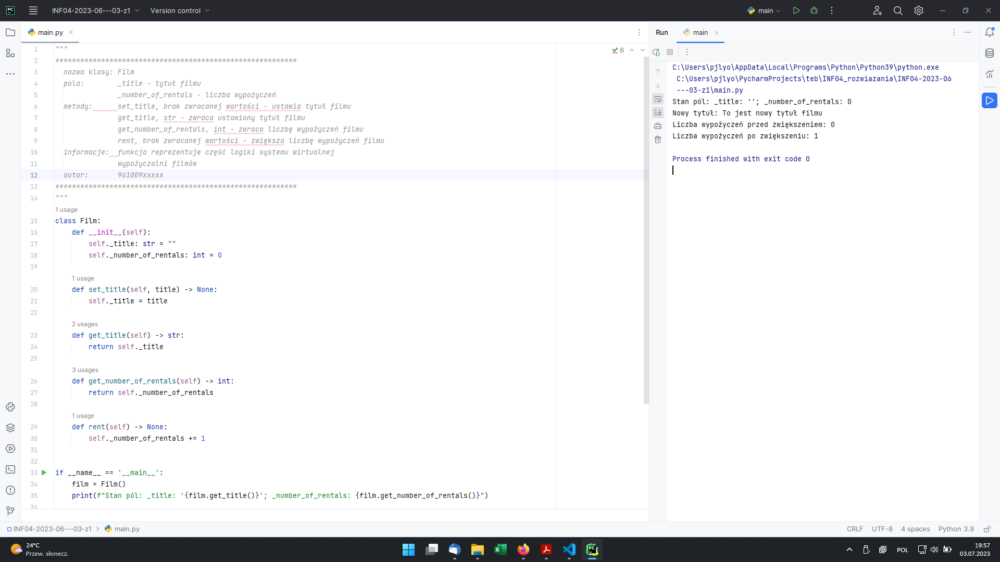
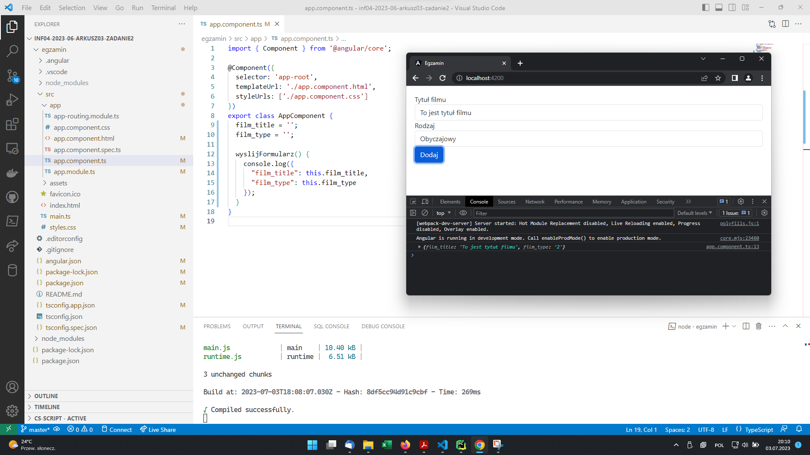
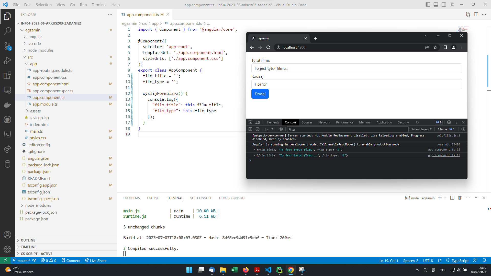

# INF.04-03-23.06-SG

## Informacje

System operacyjny: Windows 11 Pro wersja 22H2

Środowiska programistyczne: PyCharm Professional Edition, Visual Studio Code

Języki programowania: Python, Angular, Bootstrap

Komentarz: brak

## Aplikacja konsolowa

Rysunek 1. Działająca aplikacja konsolowa wraz z przeprowadzonymi testami.

## Aplikacja webowa

Rysunek 2. Aplikacja w stanie początkowym.

Rysunek 3. Wprowadzono tytuł filmu, wybrano gatunek oraz kliknięto przycisk "Dodaj"; w konsoli przedstawiono dane o filmie w wymaganym formacie.

Rysunek 4. Zmieniono tytuł filmu oraz gatunek oraz ponownie wciśnięto przycisk "Dodaj".
