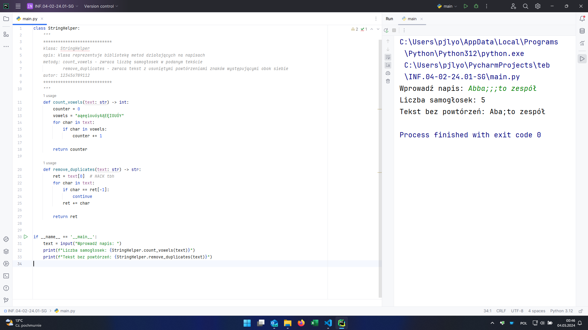
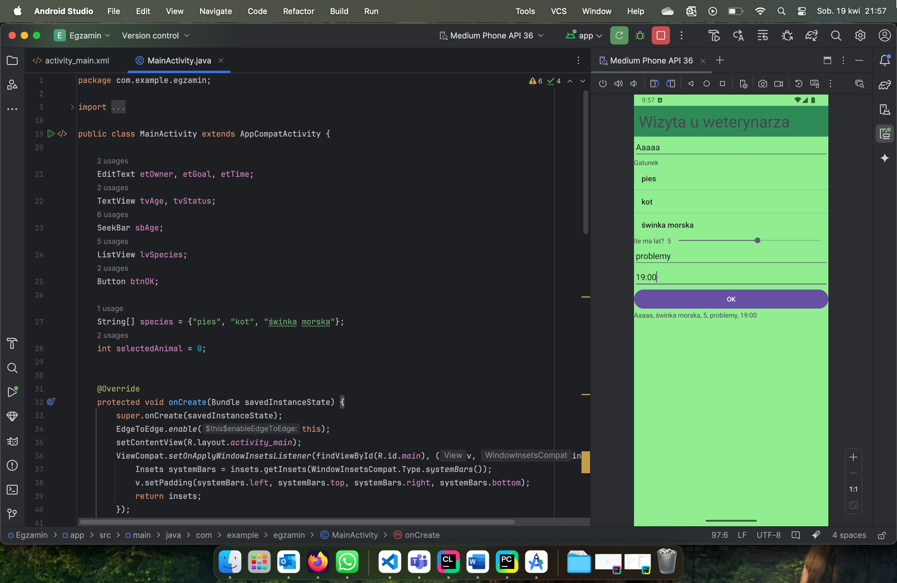
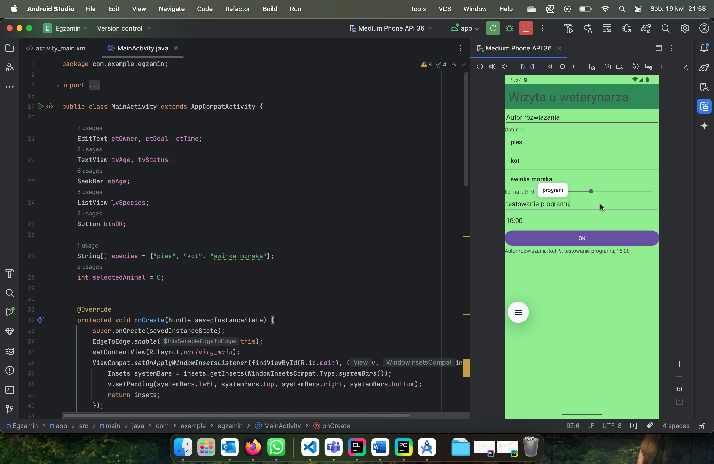

# INF.04-02-24.01-SG

System operacyjny: Windows 11 Pro, macOS Sequoia 15.4.1

Środowiska programistyczne: PyCharm Professional 2023.3, Android Studio Meerkat | 2024.3.1 Patch 1

Języki programowania: Python 3.12, Java

Emulator aplikacji mobilnej: Medium Phone API 36 - Android 16.0 Baklava | arm64

## Aplikacja konsolowa

## Aplikacja mobilna

