# INF.04-01-24.06-SG

System operacyjny: macOS Sequoia 15.4.1, ( Arch Linux, KDE Plasma z Wayland)

Środowiska programistyczne: PyCharm 2025.1, Android Studio Ladybug 2024.2.1, Eclipse IDE 2024-09 4.33.0

Emulator aplikacji mobilnej: Medium Phone API 35, Android 15 Vanilla Ice Cream

Użyte języki programowania: Python 3.9, Java 24

## Aplikacja konsolowa

### Python

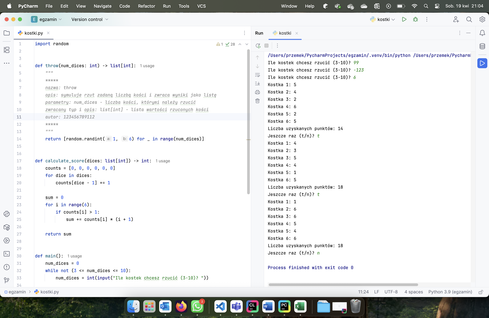

### Java

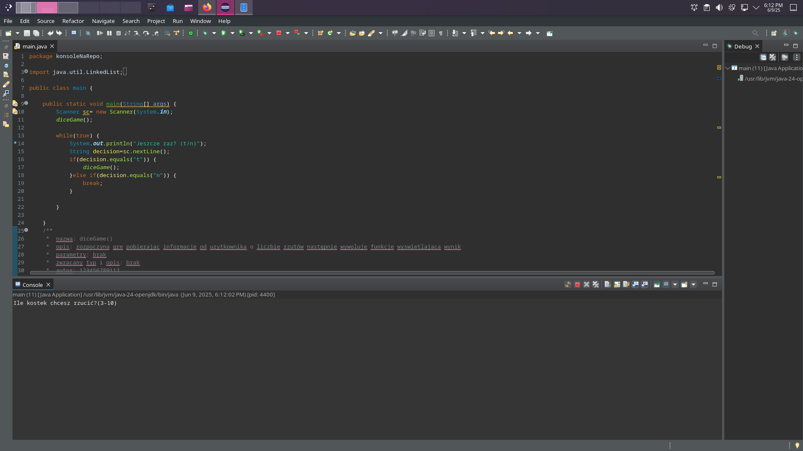
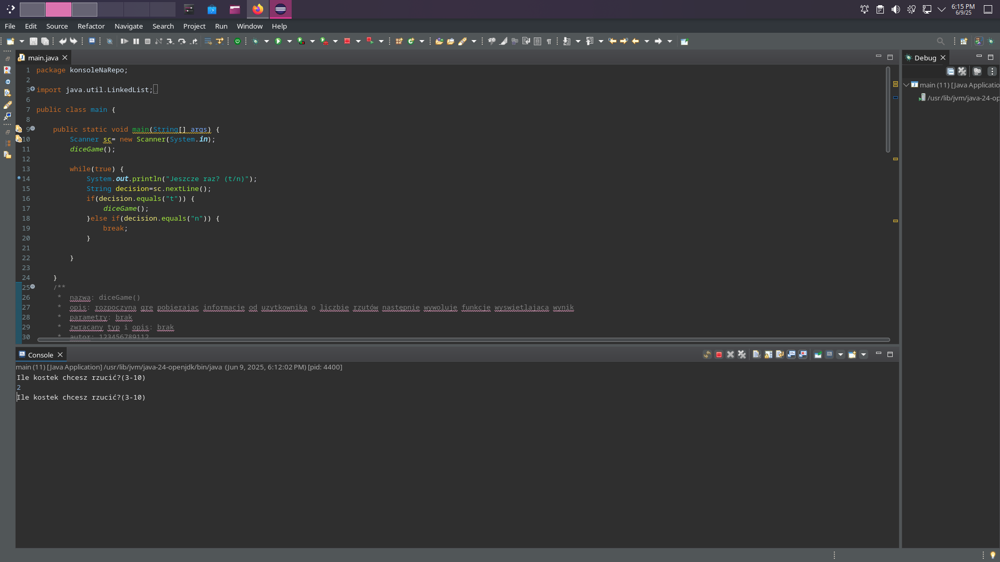
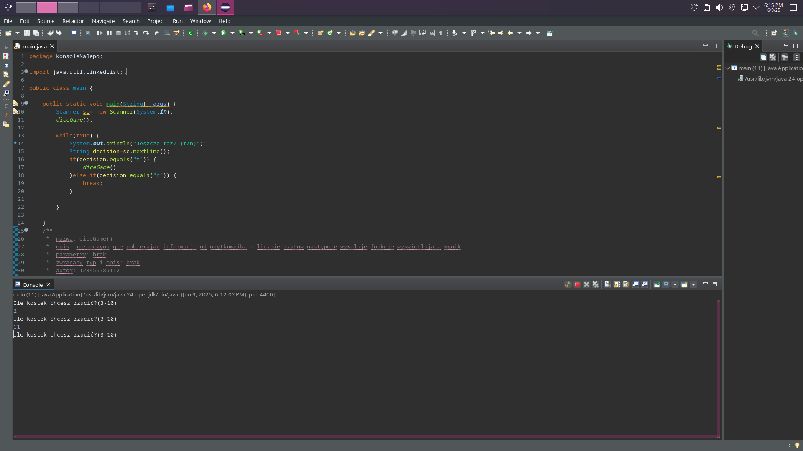
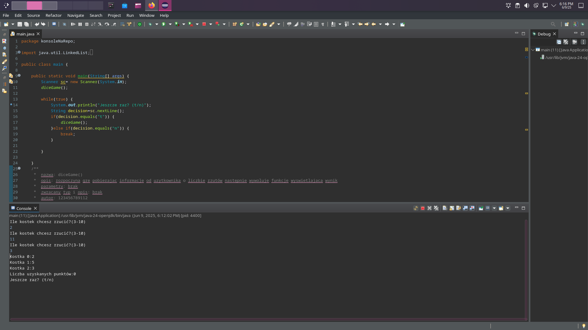

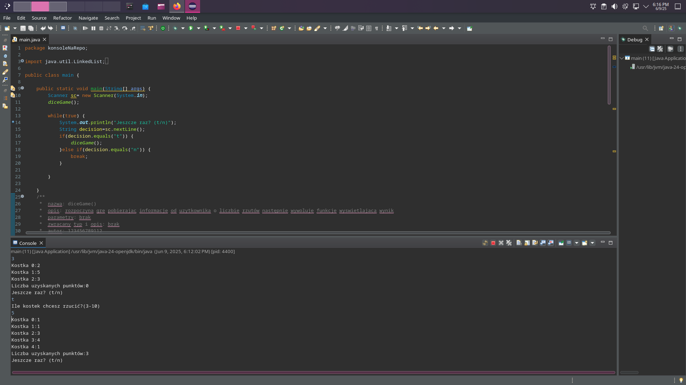
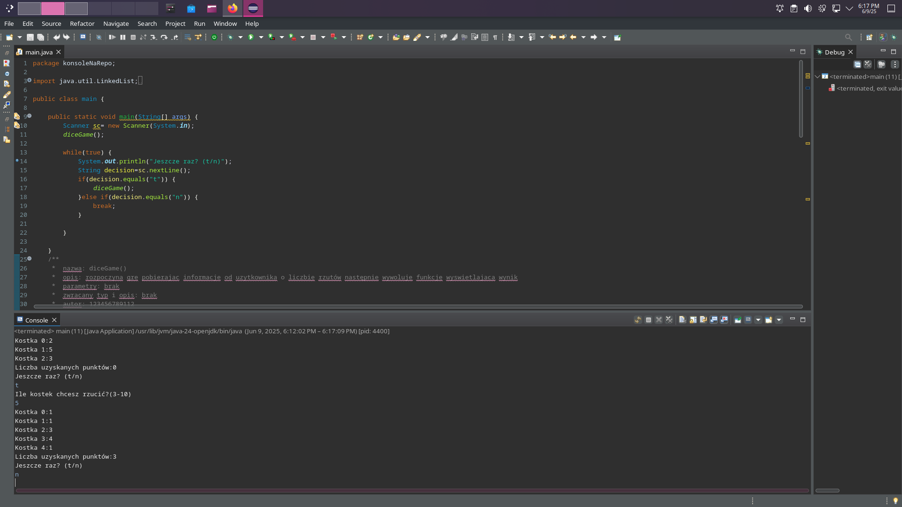

## Aplikacja mobilna

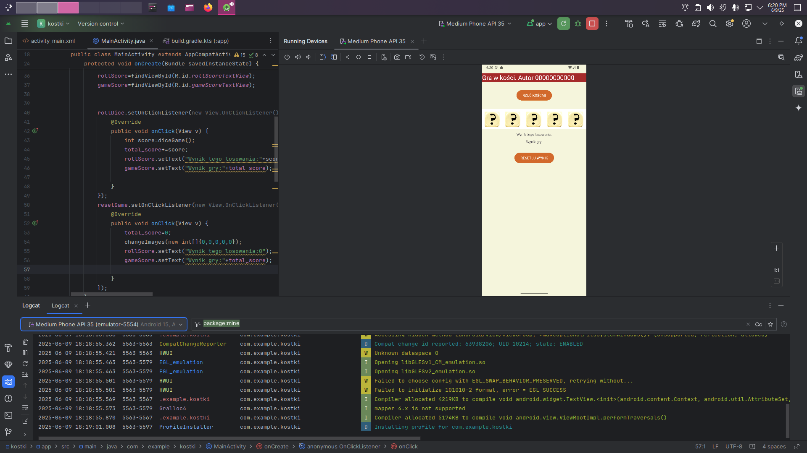
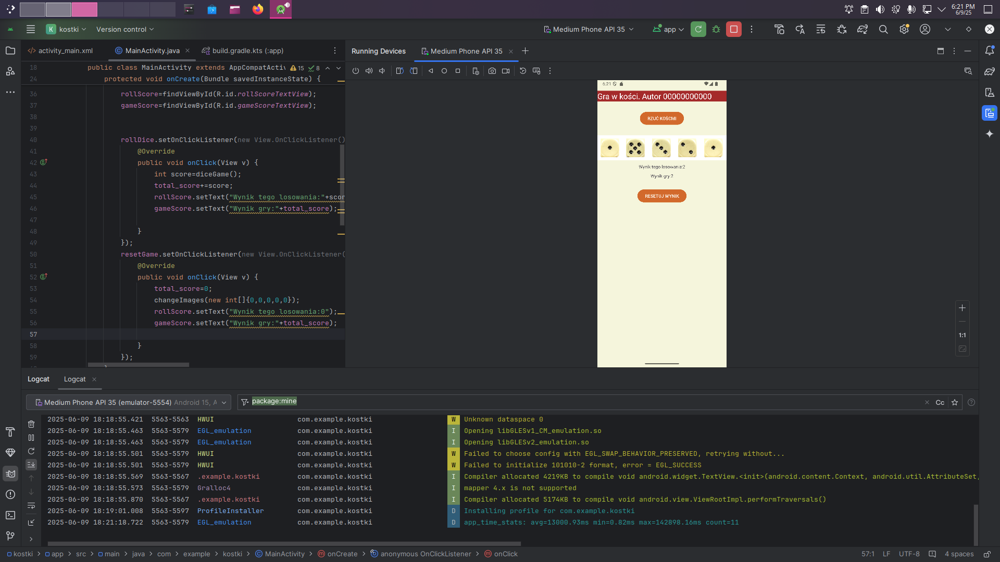
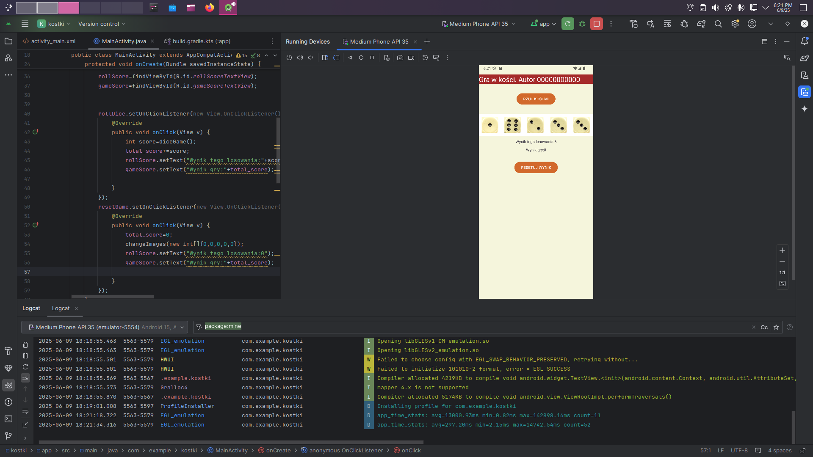

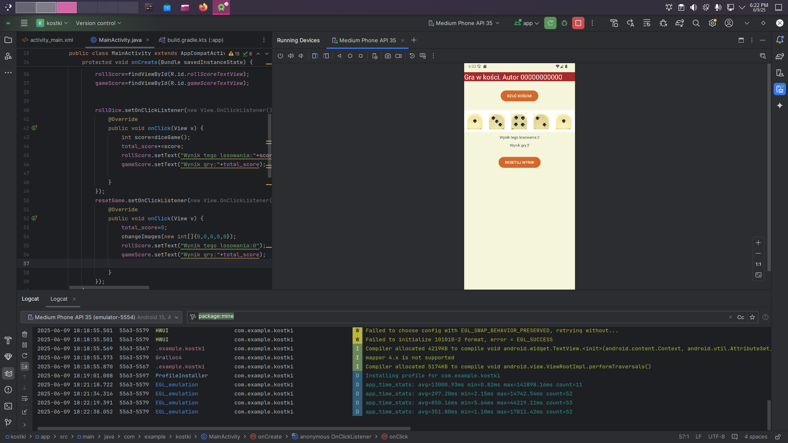
