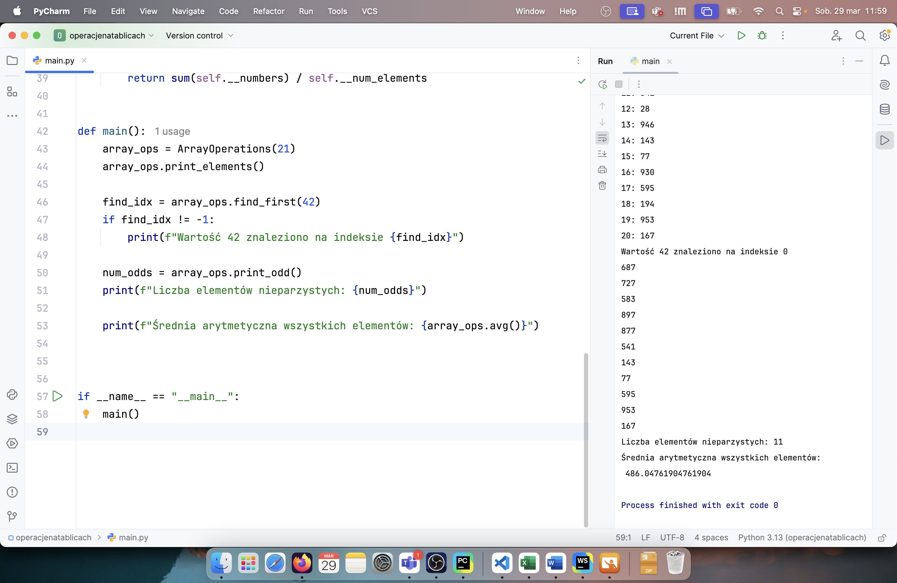
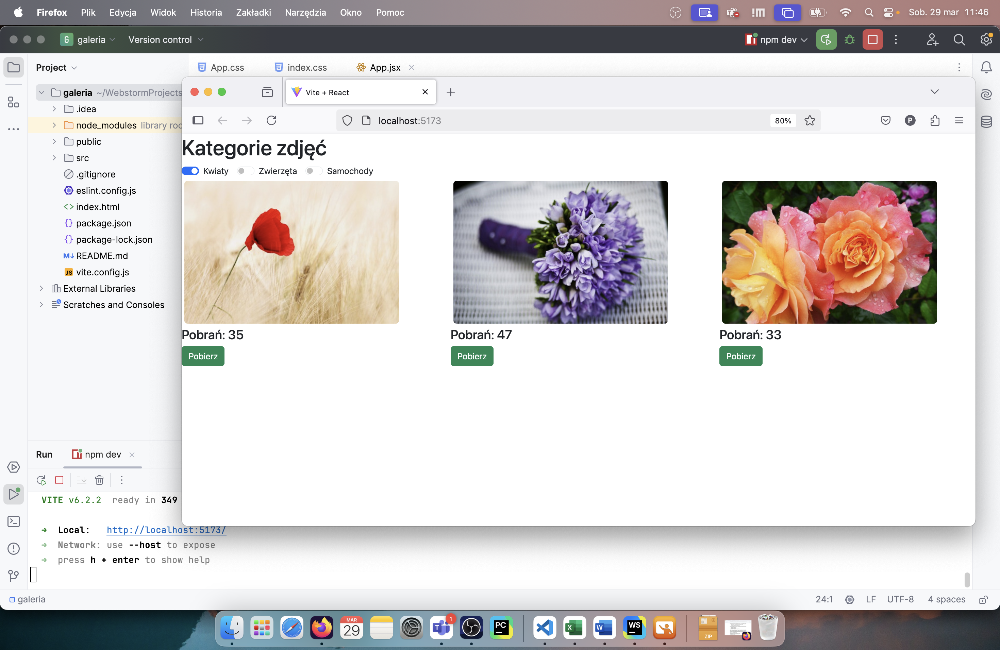
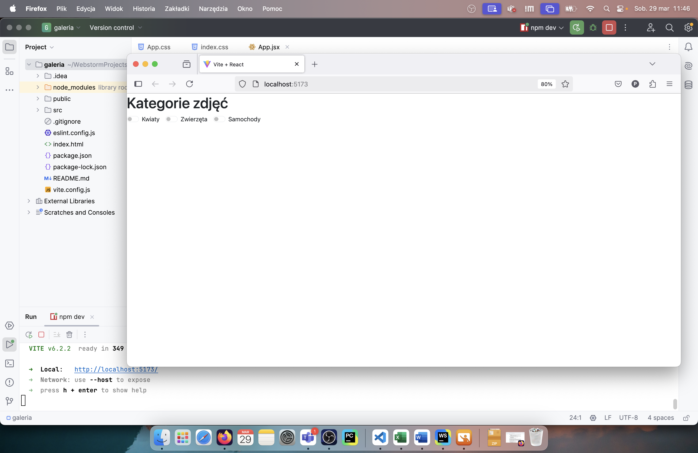
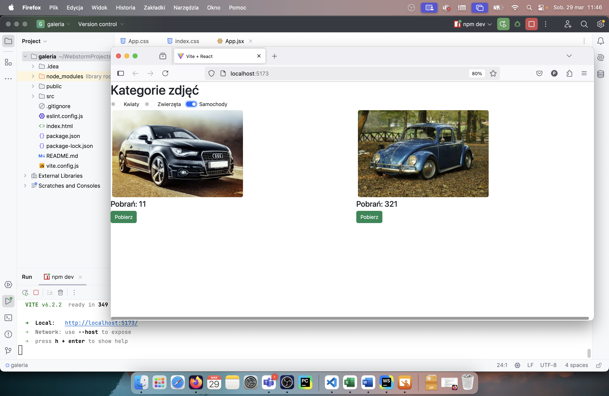

# INF.04-01-25.01-SG

## Informacje o rozwiązaniu

System operacyjny: macOS Sequoia 15.3.2

Środowiska programistyczne: PyCharm 2024.2.5 Professional Edition, WebStorm 2024.3.1

Języki programowania: Python 3.13, JavaScript

## Aplikacja konsolowa

## Aplikacja webowa

