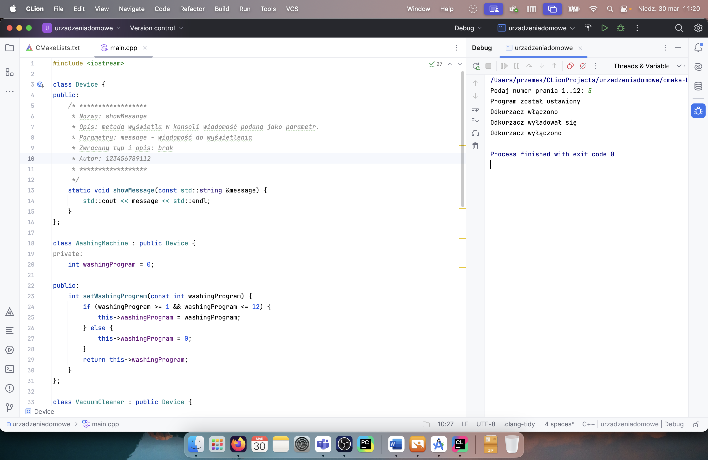
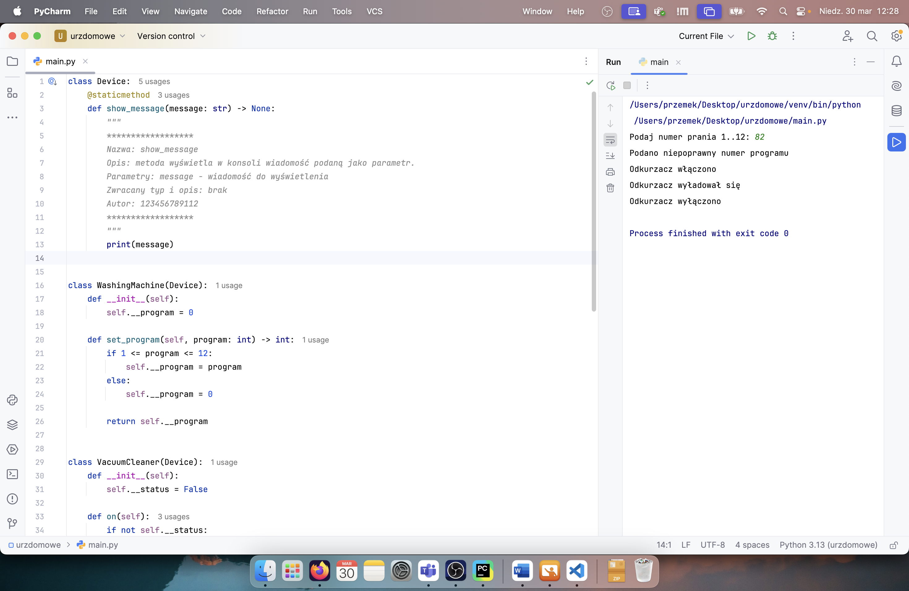
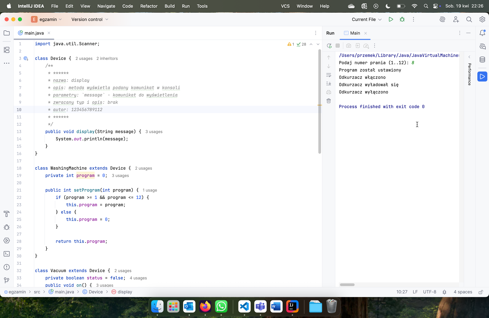
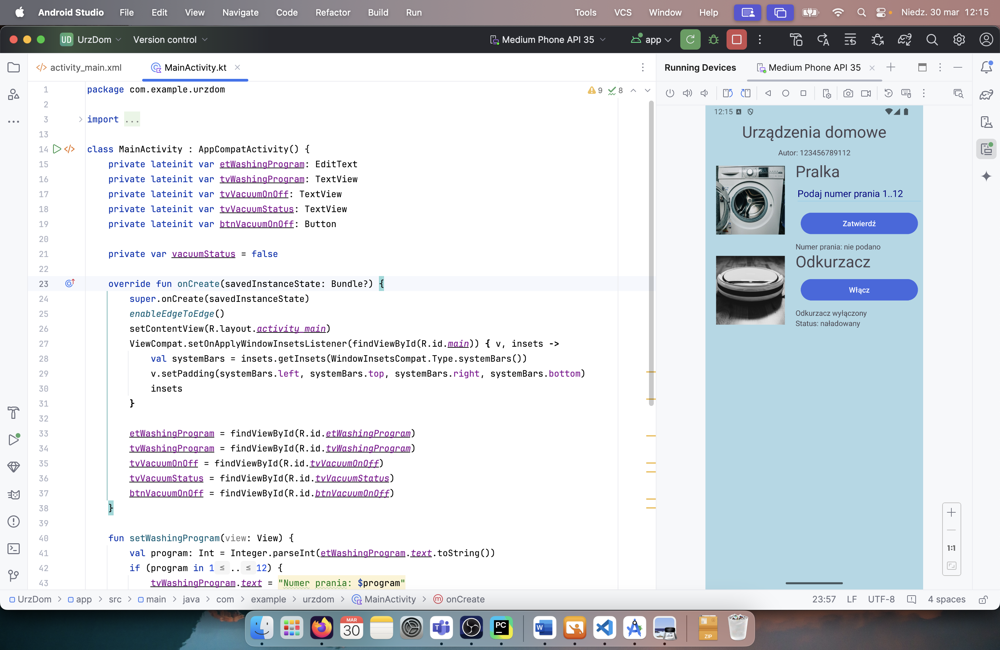
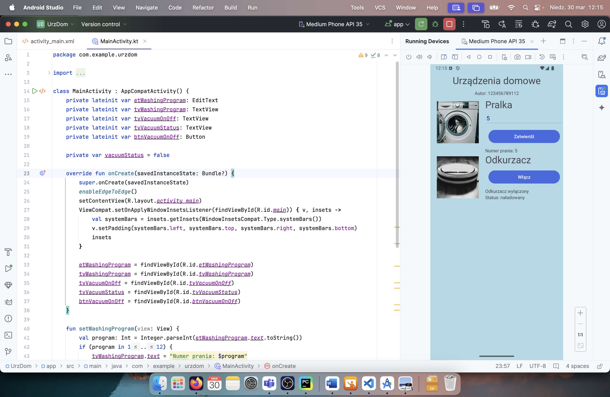
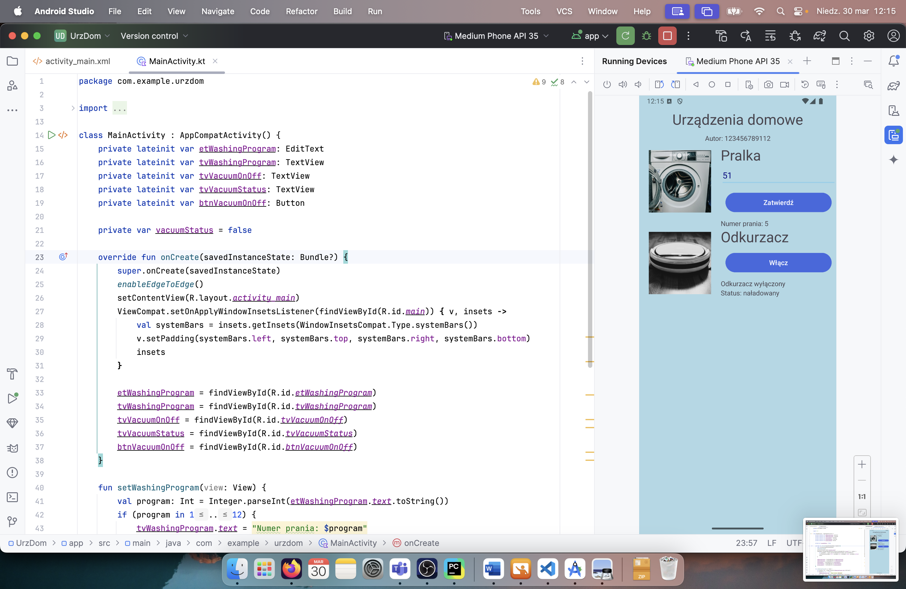
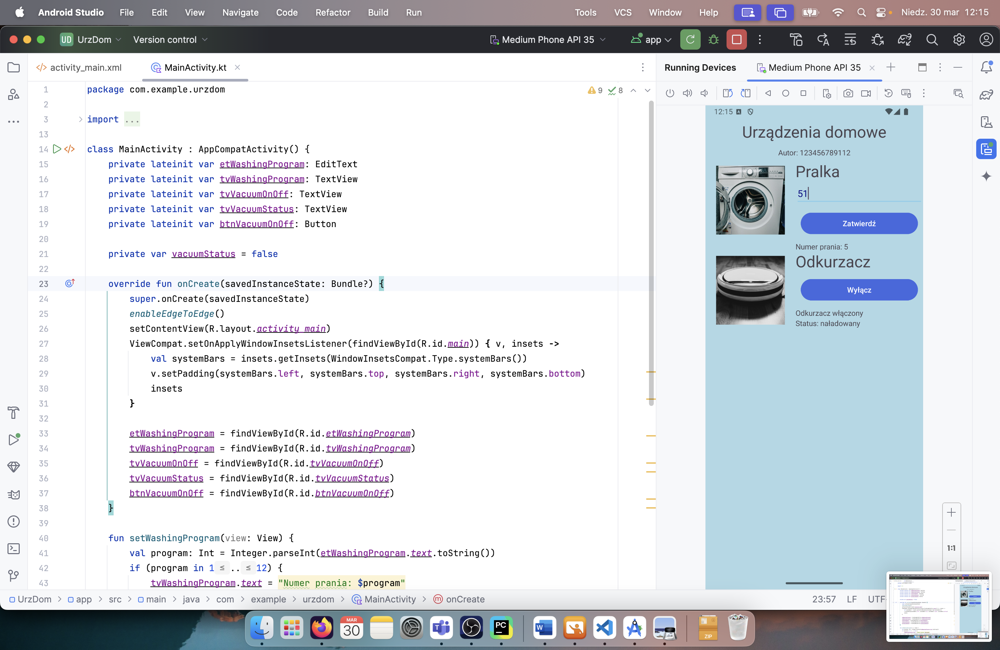

# INF.04-02-25.01-SG

## Informacje o rozwiązaniu

Nazwa systemu operacyjnego: macOS Sequoia 15.3.2

Środowiska programistyczne: CLion 2024.3.5, PyCharm 2024.2.5 Professional Edition, Android Studio Koala Feature Drop | 2024.1.2, IntelliJ IDEA 2025.1 (Ultimate Edition)

Języki programowania: C++26, Python 3.13, Kotlin, Java 24

## Aplikacja konsolowa

### C++26

### Python 3.13

### Java 24

## Aplikacja mobilna

