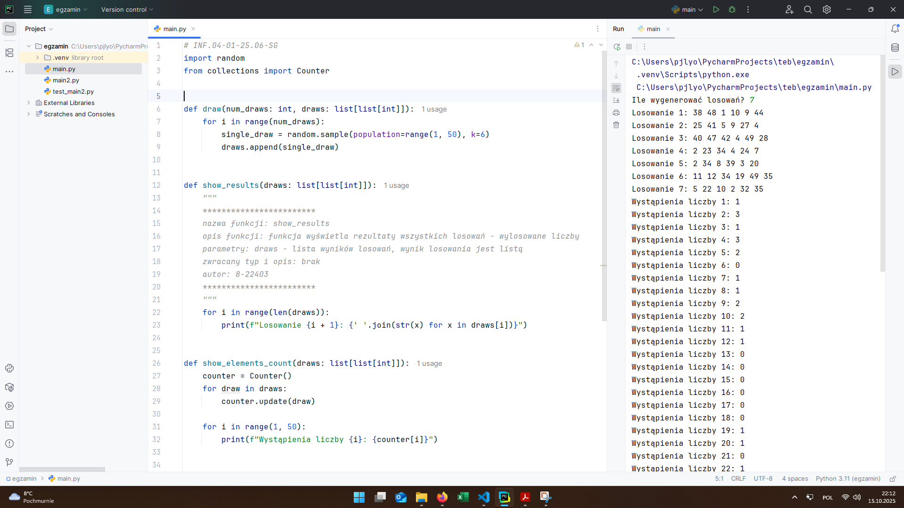
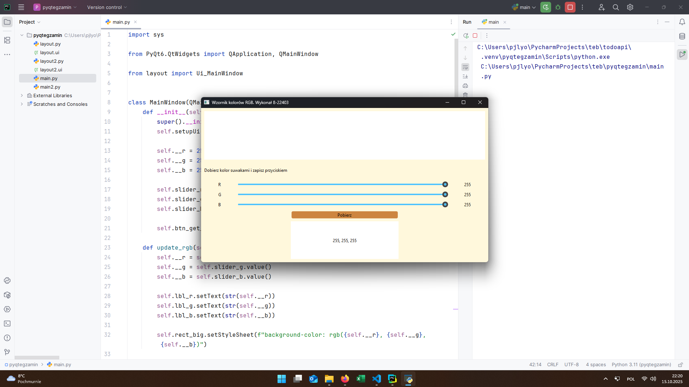
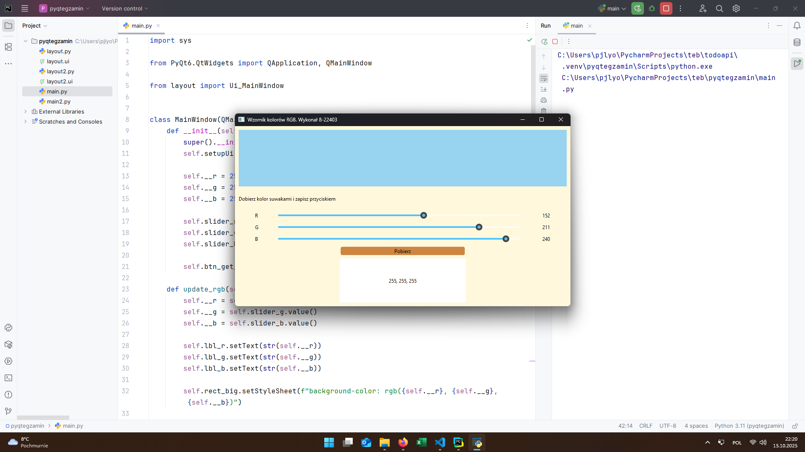
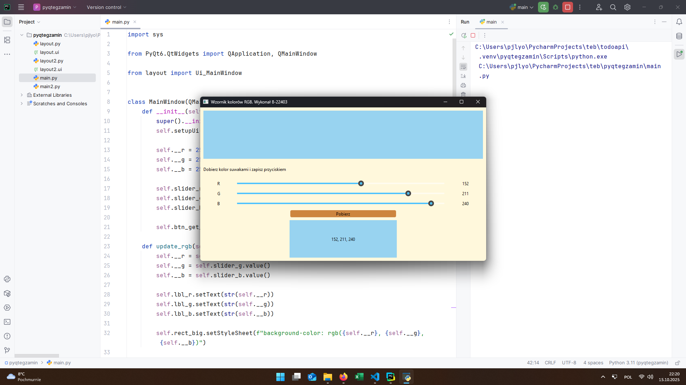
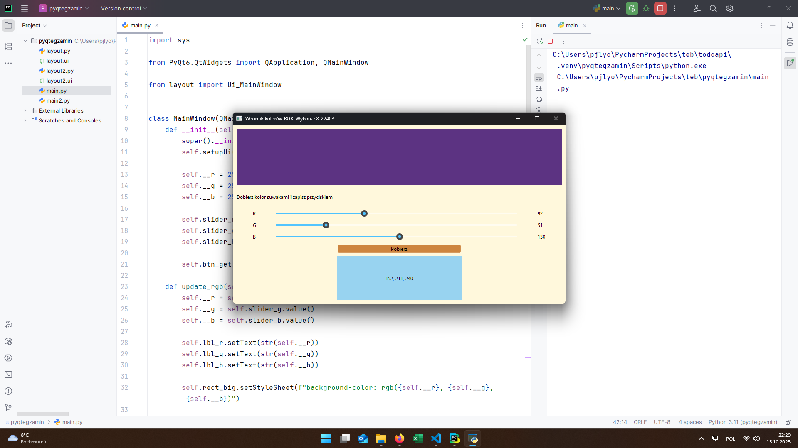

# INF.04-01-25.06-SG

## Informacje o rozwiązaniu

Nazwa systemu operacyjnego: Windows 11 Pro 24H2

Środowiska programistyczne: PyCharm

Języki programowania: Python

## Aplikacja konsolowa

### Python

## Aplikacja desktopowa

### Python + PyQT

