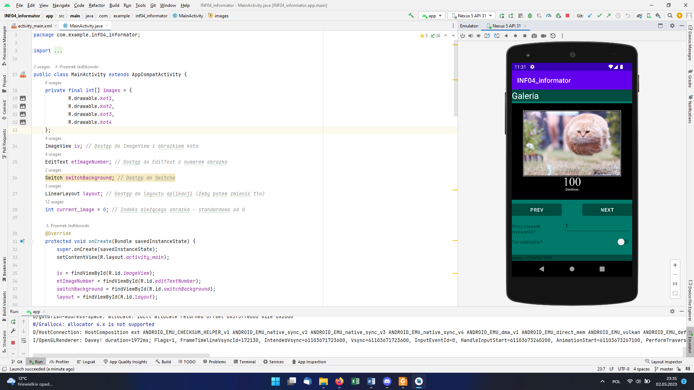
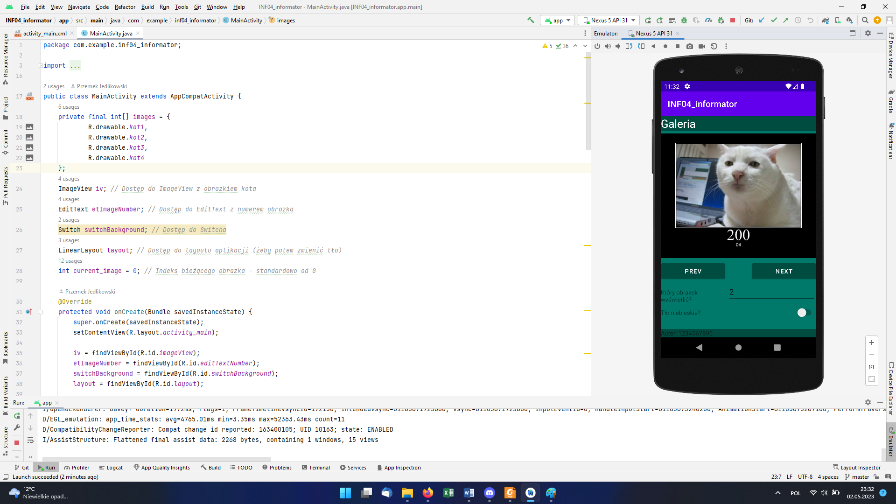
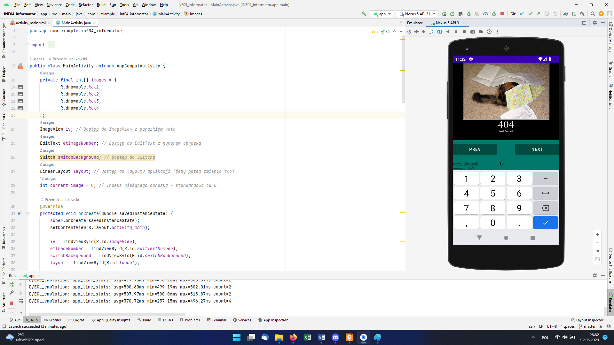
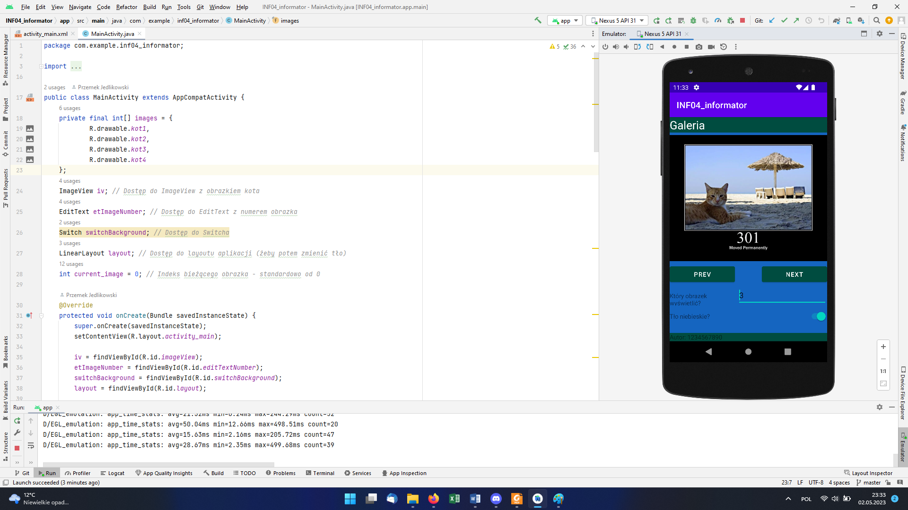

# INF.04 - zadanie z informatora

## Informacje o rozwiązaniu

System operacyjny: Windows 11 Pro wersja 22H2

Środowiska programistyczne: Android Studio Electric Eel | 2022.1.1 Patch 2; PyCharm 2023.1 (Professional Edition)

Języki programowania: Java, Python

Emulowane urządzenie: Nexus 5 API 31 (Android Oreo)

**Uwaga.** Zadanie udokumentowane zgodnie ze sposobem opisanym w najnowszych arkuszach.

## Aplikacja konsolowa

### Wersja w Pythonie z PyQT

.png)
Rysunek 1. Uruchomiono program, wprowadzono tekst do zaszyfrowania "PROGRAM" i uzyskano szyfrogram "OYPAYGM".

### Wersja w C#
.png)
Rysunek 1. Uruchomiono program, wprowadzono tekst do zaszyfrowania "To jest przykład wykonania programu gaDErYpoLUKi." i uzyskano szyfrogram "tp jdst oyzriłge wripngnkg oypaygml agEDyRopULIk.".

## Aplikacja mobilna

**Uwaga.** Do arkusza nie dostarczono archiwum z danymi, zatem zdjęcia kotów wzięliśmy ze strony [https://http.cat/](https://http.cat/). Pierwsza cyfra kodu stanu odpowiada numerowi obrazka 😅.

Rysunek 2. Stan początkowy aplikacji - bezpośrednio po uruchomieniu.

Rysunek 3. Jeden raz kliknięto przycisk NEXT.

Rysunek 4. Dotknięto pola wprowadzania numeru obrazka, usunięto liczbę 2 i wpisano liczbę 4. Zmiana liczby spowodowała zmianę wyświetlanego obrazka.

Rysunek 5. W pole "Który obrazek wyświetlić?" wprowadzono niepoprawną wartość - 6. Błędna wartość nie spowodowała błędu aplikacji.

Rysunek 6. Kliknięto przycisk PREV i zaznaczono opcję "Tło niebieskie?".
